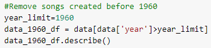
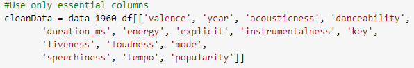
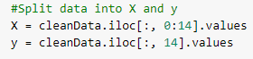
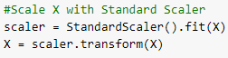
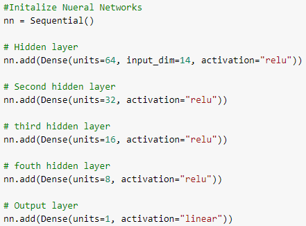
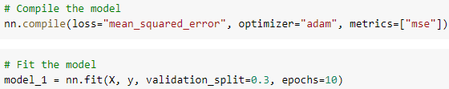
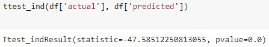
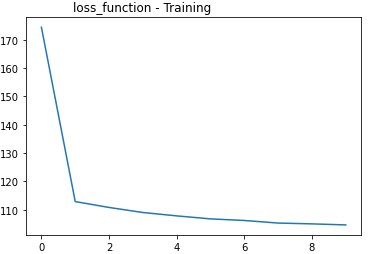
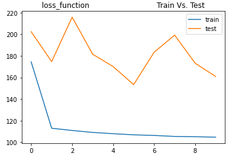
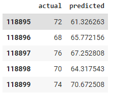

# Project 2

## Modeling

### Preparation

- Songs created before 1960 had very low popularity score so removed from dataset

- Only columns which clearly respresnted the songs were used

- We splited data into 14 input X values to predict 1 output y value

- Used Standard scaler to scale and transfrom X

### Process

- Initailized Neural Networks with 4 hidden layes

- Compiled & Fitted Model

### Analyze
- Model statistic shows a p-value less that 0.05

- Plot show loss getting lesser in Trainning

- Plot show loss between Training & Testing

- Actual popularity vs Predited popularity from model is closer

### Model Comparison - Classification Types
- Ran our test/train data for four classification type models:
    1. Deep Learning
    2. Gradient Boosting
    3. Decision Trees
    4. Random Forest

- Ran summary statistics to receive an accuracy score for each model

- Most accurate model was Random Forest

### Model Comparison - Scaler Types
- Similarly to the step above, ran our test/train data for four Scaler Types:
    1. MinMax
    2. Standard
    3. RobustScaler
    4. QuantileTransformer

- Ran summary statistics to receive an accuracy score for each scaler

- Most accurate model was StandardScaler
